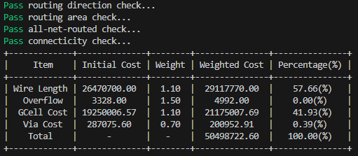

## Preparation
1. Put all input files and your `.lg` file into a directory
2. Make sure that all of your files have the same names

    For example:
    ```
    📁publicCase/  
        └── testcase0.gmp  
        └── testcase0.gcl
        └── testcase0.cst
        └── testcase0.lg
    ```

## Execution
```
$ tar xvf Evaluator.tar
$ cd Evaluator
$ chmod 755 Evaluator
$ ./Evaluator <fileDirPath> <testcaseName>

// Ex:
// ./Evaluator ~/publicCase testcase0
```

## Output Result
If you see a pretty table like this, congratulations!  


## Bonus
If you find any bugs, feel free to contact us! Once your observation is verified, you will receive 1 bonus point for this lab.
* TA1: 林煜睿, yrlin719.ee12@nycu.edu.tw
* TA2: 陳煥沅, ryan.chen.1104@gmail.com